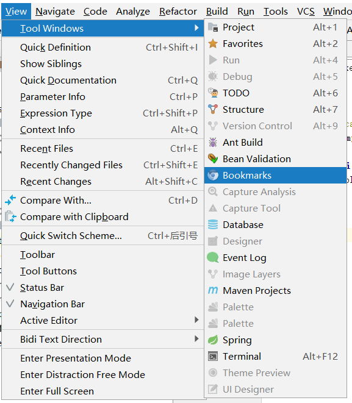
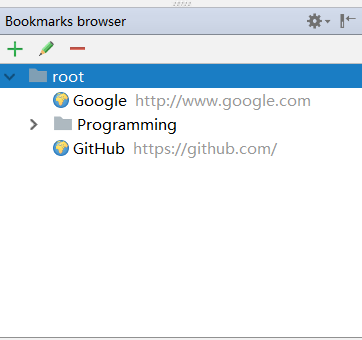
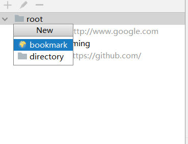
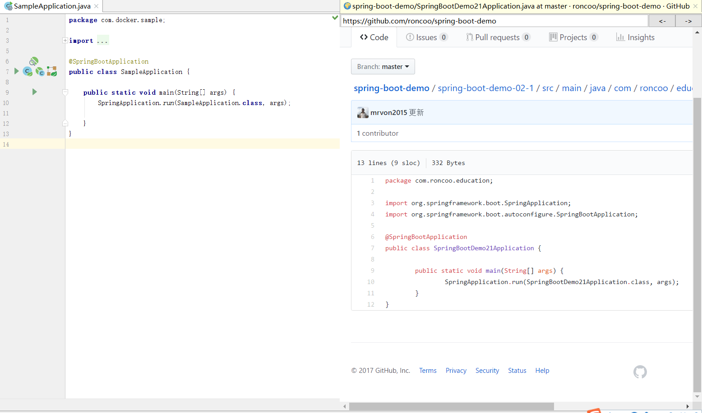
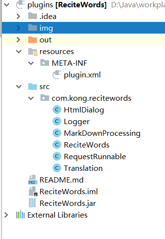
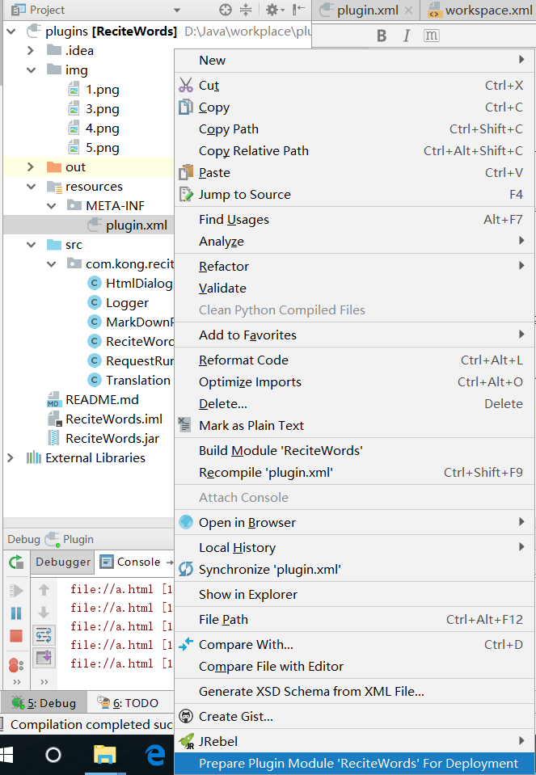

# freedomBrowser

 Fork https://github.com/hsyed/blast.browser.git
 
## 功能介绍
-  新增 markbook 菜单
    
    

-  点击后左下角出现以下内容
    
    
   
-  增删改查添加你的书签吧
     
        
    
-  浏览你的书签
   
    
       

## 新增功能
- 将原来的收费插件换成了破解版

## 使用方法

- Clone项目，获取根目录下的freedBrowser.zip。

- 打开Android Studio， Preferences -> Plugins -> Install plugin from disk -> 获取freedBrowser.zip安装并重启Android Studio。

- 第一次打开需要下载谷歌浏览器内核

## 插件开发流程
- 1 安装插件 “Plugin Devkit”,Setting -> Plugins -> Search ,安装后重启即可

- 2 安装完毕后，创建项目，发现多了以下红框内容
      
 
- 3 将项目代码copy过去新建的项目即可，如图 
      
     

- 4 调试插件，像普通的Java窗体程序开发即可，调试的时候会打开一个新的idea

- 5 插件发布，右键点击plugin.xml，选择如图所示，即可发布插件（打包插件）      
         

## 参考资料
    
   http://www.jetbrains.org/intellij/sdk/docs/user_interface_components/dialog_wrapper.html
   
    
 